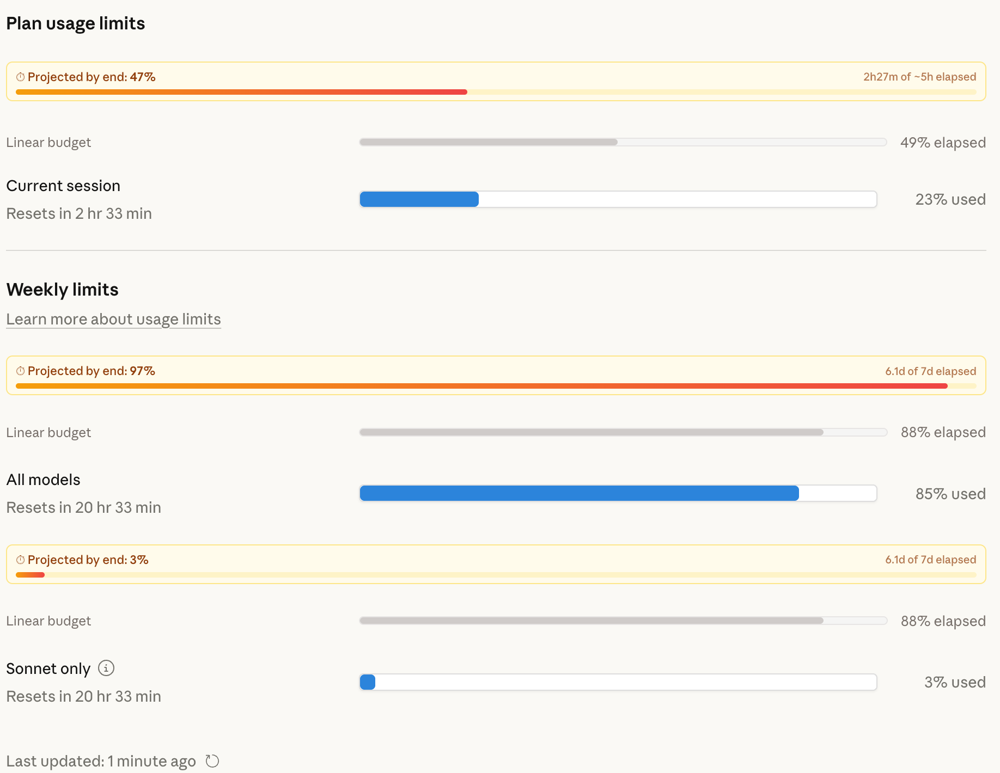
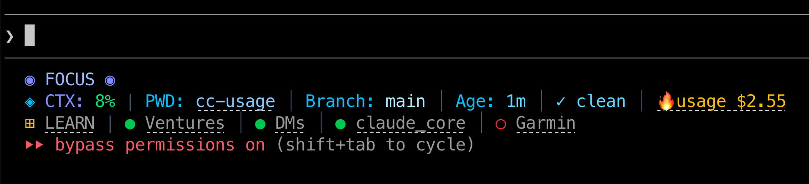

# Claude Usage Projections

Browser extension that adds **projected usage** and **linear budget** bars to Claude's usage settings page (`claude.ai/settings/usage`). Works in Chrome and Firefox.



## What it does

For each usage meter (session and weekly), the extension injects two extra indicators:

- **Projected usage** - Extrapolates your current consumption rate to estimate where you'll land by the end of the period. Turns red with a warning when projected to exceed 100%.
- **Linear budget** - Shows how much of the time period has elapsed, so you can compare your actual usage against an even pace.

## Install

### Chrome

1. Clone this repo
2. Go to `chrome://extensions`
3. Enable **Developer mode** (toggle in top-right)
4. Click **Load unpacked** and select the cloned folder
5. Navigate to [claude.ai/settings/usage](https://claude.ai/settings/usage)

### Firefox

Download the signed `.xpi` from the [latest release](../../releases/latest), open it in Firefox, and it installs permanently.

To build from source for development, use [web-ext](https://extensionworkshop.com/documentation/develop/getting-started-with-web-ext/):

```bash
npm install -g web-ext
web-ext run    # launches Firefox with the extension loaded
```

## Bonus: Claude Code status line link

You can add a clickable link to the usage page directly in your Claude Code status line.



### How to set it up

Claude Code supports a custom status line via `~/.claude/settings.json`. You need a shell script that reads JSON from stdin and outputs formatted text.

**1. Create the script** at `~/.claude/usage-statusline.sh`:

```bash
#!/bin/bash
# Reads Claude Code status JSON from stdin, appends a clickable usage link.
input=$(cat)

# Extract session cost from the JSON input
session_cost=$(echo "$input" | jq -r '.cost.total_cost_usd // 0')
cost_display=$(printf '$%.2f' "$session_cost")

# OSC 8 hyperlink: makes the text clickable in supported terminals
url="https://claude.ai/settings/usage"
link=$(printf '\033]8;;%s\033\\🔥usage %s\033]8;;\033\\' "$url" "$cost_display")

printf "%s\n" "$link"
```

```bash
chmod +x ~/.claude/usage-statusline.sh
```

**2. Add it to your settings** in `~/.claude/settings.json`:

```json
{
  "statusLine": {
    "type": "command",
    "command": "~/.claude/usage-statusline.sh"
  }
}
```

The link opens `claude.ai/settings/usage` in your browser (where the extension adds the projection bars). Requires a terminal that supports [OSC 8 hyperlinks](https://gist.github.com/egmontkob/eb114294efbcd5adb1944c9f3cb5feda) (iTerm2, Kitty, WezTerm, Windows Terminal, etc.).

## Files

| File | Purpose |
|------|---------|
| `manifest.json` | Extension manifest (Manifest V3, no special permissions) |
| `content.js` | Content script that reads progress bars and injects projection/budget UI |
| `styles.css` | Styling for projection and budget bars |

## License

MIT
